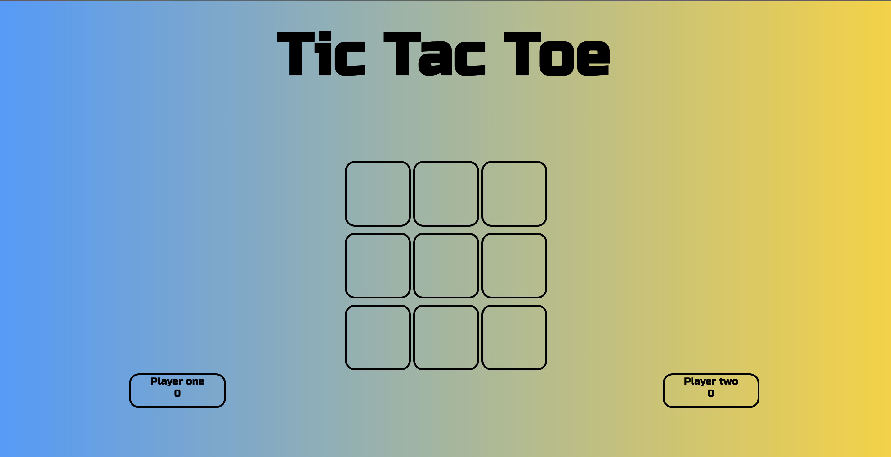
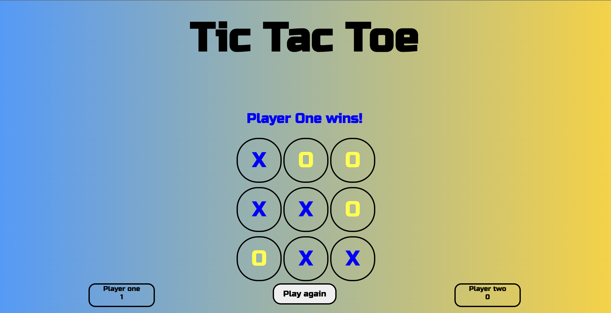

# Tic Tac Toe

This game application allows the user to play rounds of the popular game  **Tic Tac Toe**, and track their total wins. I (Dominik michel) completed this application as my first complete coding project at General Assembly Sydney in July 2022.

  

## My Approach  

First, I created a basic HTML page, with all the necessary structures like the header, body, links, divs etc.  After that, I started working on the style sheet and changed the things like the background, text and layout to a point where I was happy with the result.

Least but not last, I tackled the JavaScript part, where I took some time for the planning, collecting ideas and structuring, to keep the code DRY and clean.  So I drew the game on paper and labelled every field with a number to find all possible win options to put these in an array. 
Created then the function to play the game which included that the fields which have been clicked, could not be clicked again. The players taking turns where I used a boolean for.
I used then for both players the same principle, the field they clicked on, gets a class with their symbol. Each of these classes pushed the ID (the field number)  into an array which I joined to a string. After, the function loops through the possible win array which contains arrays with the combinations for a win strike( which I combined then to a string as well). Then it’s checking if the user's choice includes all 3 numbers of all the possible win strikes. If this is the case, a headline comes up which player won and a point gets added to the player’s account. As the headline with the winner announcement comes up, a restart button does too for a new game. If there is no winner and all fields have been clicked the draw function comes into effect and checks if all fields were clicked but no headline was displayed. If this is the case the draw headline displays and a new game can be played.

 

## Future changes/ Unsolved Problems

- Make it a multiplayer version for 2 devices at the same time.
- Create an AI oppnent 

 

## Blockers I had 

- Comparing the choices with the win as an array is not == to the same array. Thats why I have converted them to a sting and cmpared them then. 
- To turn off the click function when a player won so that no field could be clicked anymore
- The draw function because I didn't set the *return* and then set it also in the wrong location

 

## Technologies I used
- jQuery JavaScript Library v3.6.0
- Vanilla JavaScript
- CSS
- HTML

 

## Links 
 1. The Game  https://dommich95.github.io/project0/
 2. My Linkedin https://www.linkedin.com/in/dominik-michel

 

## The Game

 

